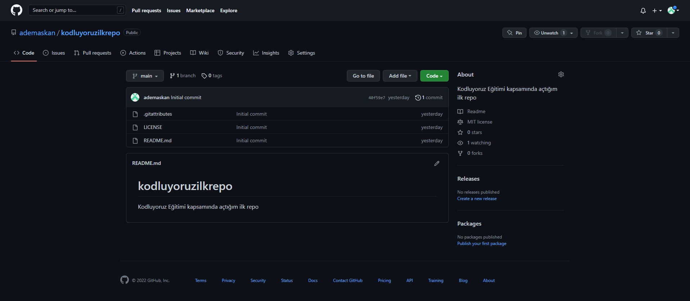

# kodluyoruzilkrepo

Kodluyoruz Eğitimi kapsamında açtığım ilk repo

# Installation

    Öncelikle projeyi klonlayın
        > https://github.com/ademaskan/kodluyoruzilkrepo.git

# Usage

projeyi klonladıktan sonra Visual Studio Code programında açınız.

Linux için:

> cd kodluyoruzilkrepo
> code .

# Contributing

Pull requestler kabul edilir. Büyük değişiklikler için, lütfen önce neyi değiştirmek istediğinizi tartışmak için bir konu açınız.

# License

[MIT](https://choosealicense.com/licenses/mit/)
